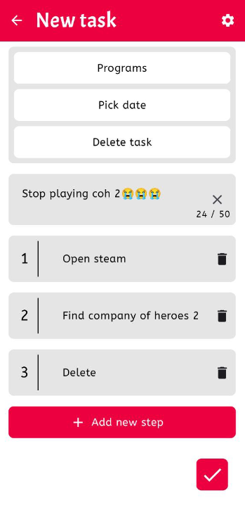
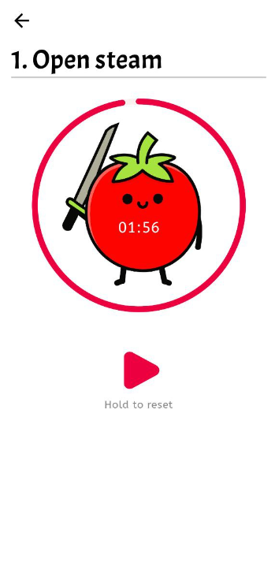
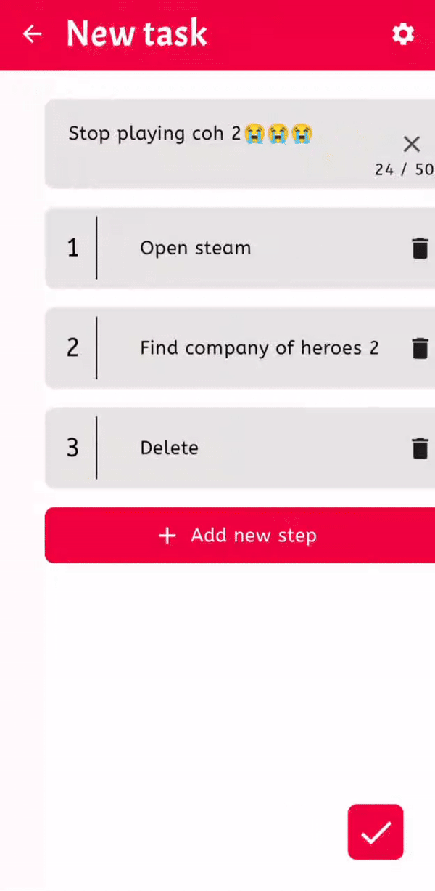

## Pomodoro Kaizen!

**What is this app?**
A simple app that will help you distribute your to-do's according to the tomato technique!

**What is the pomodoro technique?**
This is a time management technique proposed by Francesco Cirillo in the late 1980s.  

The technique involves increasing work efficiency with less time spent through deep concentration and short breaks. In the classic technique, time segments - “tomatoes” - last half an hour: 25 minutes of work and 5 minutes of rest.

**Basic principles:**

- Decide on the tasks you plan to do, prioritize them.

- Set a timer for 20-25 minutes.

- Work without any distractions until the timer beeps.

- Take a short break (5 minutes).

- After every 4th tomato, take a long break (15-30 minutes).

**What is kaizen?**
Kaizen is a Japanese philosophy or practice that focuses on continuous process improvement in manufacturing, development, supporting business processes and management, and all aspects of life.

## Based on

- Jetpack Compose
- Dagger Hilt

**Clean Architecture and MVI**

